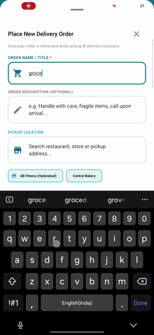
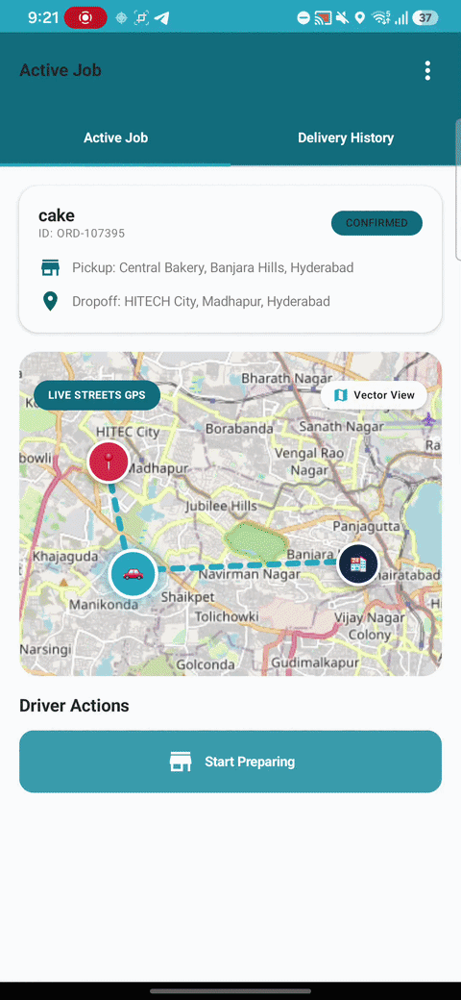
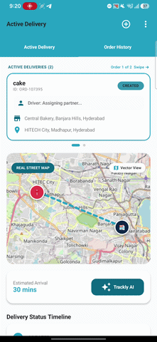

# Trackly — Real-Time Android Delivery & Live Package Tracking App


> **Trackly** is a production-grade native Android application for real-time package delivery and live logistics tracking engineered by **Yash Jaint**. Built using **Multi-View View Model (MVVM)** pattern and **Multi-Module Clean Architecture with Domain Use Cases**, Trackly leverages **Dagger Hilt Dependency Injection**, **Kotlin Coroutines**, **StateFlow**, **Room Database**, **Retrofit REST API Integration**, **Google Maps SDK**, and **Google Gemini AI Integration**, powered by an asynchronous **Ktor Kotlin Backend Server** to deliver a seamless real-time tracking experience for both customers and delivery drivers.

---

## 👨‍💻 Author & Original Ownership Notice

**Trackly** was conceptualized, designed, and developed by **Yash Jaint**.

- **Author**: Yash Jaint
- **GitHub**: [@yashjaint](https://github.com/yashjaint)
- **LinkedIn**: [Yash Jaint](https://www.linkedin.com/in/yash-jaint/)
- **Copyright**: © 2026 Yash Jaint. Licensed under the [MIT License](LICENSE).

---

## ⚡ Application Feature Breakdown

- **📦 Customer Portal**:
  - **Order Creation & Search Suggestions**: Debounced search query autocomplete for pickup and delivery locations powered by OpenStreetMap search.
  - **Live Google Maps Tracking**: Displays live driver position updates, pickup/dropoff markers, route polyline paths, and dynamic arrival ETA calculation.
  - **Stage-by-Stage Timeline**: Visual stage progress tracker (`CREATED` $\rightarrow$ `CONFIRMED` $\rightarrow$ `PREPARING` $\rightarrow$ `READY_FOR_PICKUP` $\rightarrow$ `PICKED_UP` $\rightarrow$ `OUT_FOR_DELIVERY` $\rightarrow$ `DELIVERED`).
  - **Active Swipable Order Cards & History**: Swipe between multiple active ongoing orders or review past order history.
- **🚚 Delivery Driver Portal**:
  - **Milestone Controls**: Accept delivery jobs and update delivery status milestones step-by-step.
  - **Background Location Service**: Broadcasts live driver GPS coordinates via a dedicated Android `ForegroundService` with heads-up notification drawer updates.
  - **Delivery History**: Review past completed driver deliveries.
- **🤖 Integrated Gemini AI Assistant**:
  - Interactive bottom-sheet AI assistant answering customer questions about package status in plain language using the Google Gemini API.
- **👤 Profile & Account Management**:
  - Profile customization (Name & Vehicle Number) via 3-dot overflow menu with safeguards preventing account deletion while orders are active.

---

## 🎬 Feature Walkthrough Demos

### 📍 1. Order Creation & Geolocation Address Suggestions

| Demo Preview | Feature Description & Technical Highlights |
| :---: | :--- |
|  | **Smart Order Creation with Real-Time Geolocation Autocomplete**<br><br>• **Geolocation Address Suggestions**: Suggests real-time nearby streets, landmarks, and location suggestions as the user types.<br>• **Debounced Search Query Flow**: Utilizes Kotlin Coroutines `debounce(300ms)` flow operator to prevent redundant network calls and rate-limiting while typing.<br>• **Dynamic Route ETA Calculation**: Instantly computes arrival time estimations derived from pickup and delivery coordinate spherical distance metrics.<br>• **Custom Package Details**: Form validation capturing order title, item description, and exact coordinates. |

---

### 🚚 2. Delivery Driver Portal & Foreground Location Tracking Service

| Demo Preview | Feature Description & Technical Highlights |
| :---: | :--- |
|  | **Delivery Milestone Control & Persistent Location Broadcasting**<br><br>• **Android Foreground Location Service**: Launches a persistent background `LocationService` with a heads-up status bar notification to capture and broadcast driver GPS coordinates continuously even when the app is minimized.<br>• **Order Milestone State Machine**: Drivers progress orders through deterministic lifecycle stages (`ASSIGNED` $\rightarrow$ `PICKED_UP` $\rightarrow$ `OUT_FOR_DELIVERY` $\rightarrow$ `DELIVERED`).<br>• **Real-Time WebSocket Streaming**: Streamed GPS location updates (`lat`, `lng`) transmitted live over WebSockets to update customer map view polyline and vehicle marker. |

---

### 🤖 3. Interactive Gemini AI Assistant

| Demo Preview | Feature Description & Technical Highlights |
| :---: | :--- |
|  | **Generative AI Package Support & Delivery Assistant**<br><br>• **Google Gemini AI Integration**: Integrates the Gemini API model to provide instant conversational support for delivery queries.<br>• **Contextual Prompt Engineering**: Constructs real-time prompts containing active order ID, item title, current milestone stage, pickup/delivery addresses, and driver details.<br>• **Jetpack Compose Bottom Sheet UI**: Interactive modal bottom sheet interface featuring animated message bubbles, loading states, and natural language response rendering. |

---

## 📹 Full Video Walkthrough

> 🎬 **Complete End-to-End Application Demo**:  
> Watch the full 5-minute video walkthrough covering account registration, order creation with debounced address search, driver job assignment, live map tracking, timeline status transitions, and AI chatbot interaction.
> 
> 🔗 **[Watch Full Video Walkthrough](https://github.com/yashjaint/Trackly)** *(Upload to YouTube / Google Drive / GitHub Releases to insert link)*

---

## 📱 Technology & Architecture Stack

Trackly is engineered following modern Android and Kotlin development guidelines:

| Layer | Technologies & Frameworks Used |
| :--- | :--- |
| **UI Framework** | Jetpack Compose, Material Design 3, Custom Glassmorphism UI tokens |
| **UI Pattern** | **Multi-View View Model (MVVM)** with `StateFlow` and `Coroutines` |
| **Architecture** | **Clean Architecture** (Domain Layer **Use Cases** & Repositories + Data Layer Implementations) |
| **Modularization** | **Multi-Module Gradle** (`:feature:customer-tracking`, `:feature:driver-delivery`, `:feature:ai-assistant`, `:feature:auth`, `:core:network`, `:core:location`, `:core:websocket`, `:core:database`, `:core:model`, `:core:common`) |
| **Dependency Injection** | Dagger Hilt |
| **Local Persistence** | **Room Database** (Entities, DAOs, Local Caching) |
| **Maps & Location** | Google Maps SDK for Android, FusedLocationProviderClient, Android Foreground Service |
| **Networking & APIs** | **Retrofit**, OkHttp3 REST API Integration, Ktor WebSockets Client |
| **AI Integration** | **Google Gemini API Integration** |
| **Backend Service** | **Ktor Kotlin Backend Server** (Netty Engine, Exposed ORM, HikariCP Connection Pooling, H2 DB) |

---

## 📁 Repository Directory Layout

```
Trackly/
├── android/                   # Multi-Module Jetpack Compose Android Client
│   ├── app/                   # Navigation Host & Hilt Application Entrypoint
│   ├── feature/               # UI Feature Modules (MVVM + Domain Use Cases)
│   │   ├── customer-tracking/ # Active Tracking, Order Timeline & Address Autocomplete
│   │   ├── driver-delivery/   # Delivery Driver Job Portal & Status Management
│   │   ├── ai-assistant/      # Gemini AI Chatbot Sheet & AskAiAssistantUseCase
│   │   └── auth/              # Login & Register Screens, LoginUseCase & RegisterUseCase
│   └── core/                  # Core Layer (Domain Repositories & Data Implementations)
│       ├── network/           # Retrofit REST API Interfaces & Data Repository Impls
│       ├── database/          # Room Database (DAOs & Local Entities)
│       ├── location/          # Foreground Service & Location Provider
│       ├── websocket/         # Real-Time WebSocket Location Engine
│       ├── model/             # Shared Domain Models & Enums
│       └── common/            # Design System, Google Maps View & Dialogs
├── backend/                   # Asynchronous Ktor Kotlin Backend Monolith
│   └── src/main/kotlin/com/trackly/
│       ├── core/              # Database Factory & JWT Security Config
│       └── features/          # Auth, Order Management, Driver Location & WebSockets
├── LICENSE                    # MIT Copyright License (Yash Jaint)
└── README.md                  # Project Documentation
```

---

## 🚀 Quick Start & Installation

### 1. Start the Ktor Backend Server
```bash
cd backend
./gradlew run
```

### 2. Build & Deploy the Android Application
Open `android/` in Android Studio or build via CLI:
```bash
cd android
./gradlew installDebug
```

---

## 📜 License & Copyright

Copyright © 2026 **Yash Jaint**.  
This project is released under the [MIT License](LICENSE).
